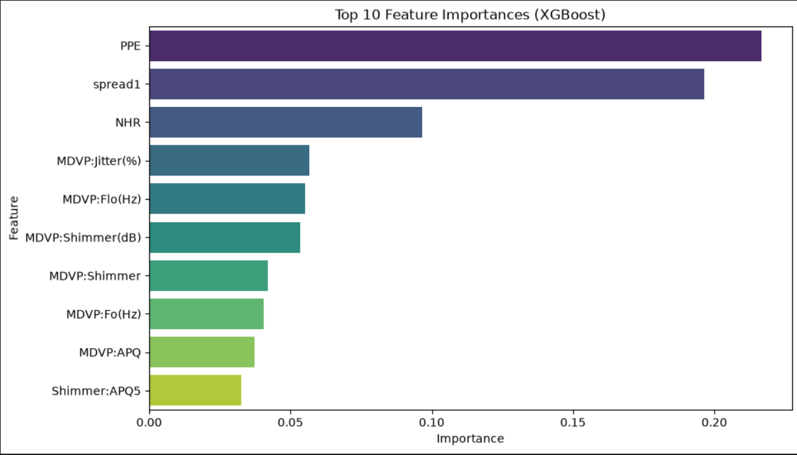
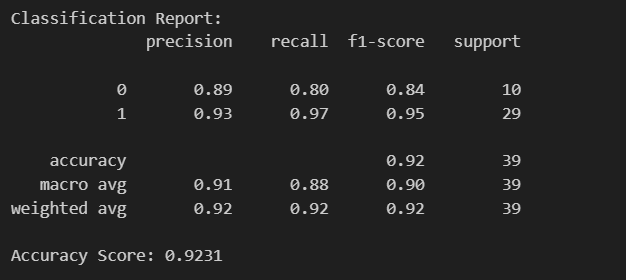
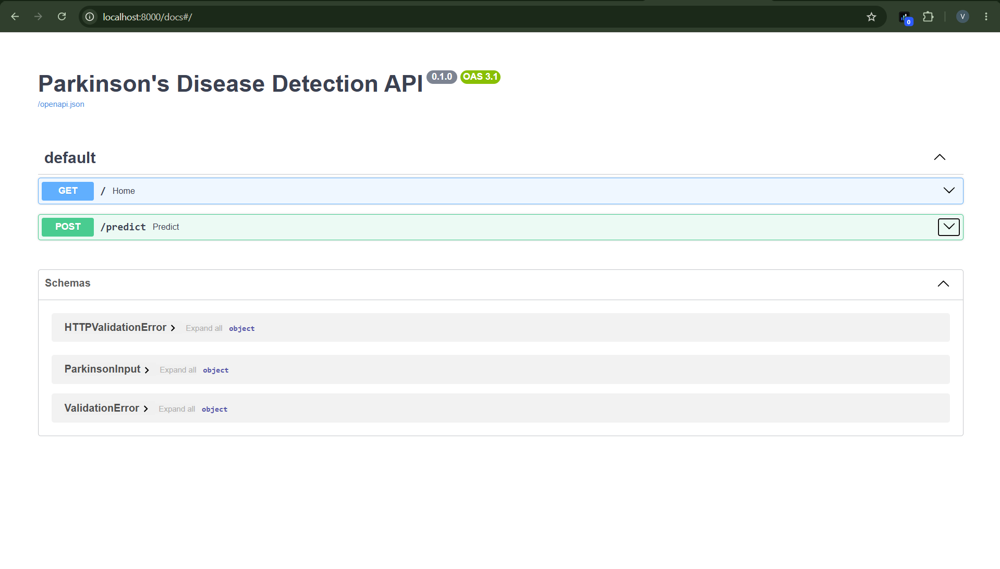
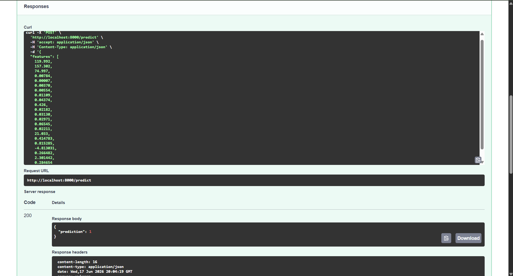

# Parkinson's Disease Detection using XGBoost, FastAPI & Docker

## Overview

Parkinson's Disease is a progressive neurological disorder that affects movement, speech, balance, and coordination. It occurs due to the gradual loss of dopamine-producing neurons in the brain. Early diagnosis can help patients manage symptoms and improve quality of life.

This project uses biomedical voice measurements to predict whether a person has Parkinson's Disease. An XGBoost machine learning model was trained on the UCI Parkinson's dataset and deployed as a REST API using FastAPI. The application was containerized using Docker to ensure portability and reproducibility.

---

## About Parkinson's Disease

Parkinson's Disease (PD) is a neurodegenerative disorder that primarily affects the nervous system and motor functions.

### Common Symptoms

* Tremors (shaking)
* Slowed movement (Bradykinesia)
* Muscle stiffness
* Impaired balance and coordination
* Changes in speech and voice

### Why Voice Data?

Research has shown that Parkinson's Disease can affect vocal characteristics such as:

* Frequency variations
* Vocal tremors
* Hoarseness
* Reduced speech clarity

These subtle voice changes can be captured through biomedical voice measurements and analyzed using machine learning techniques.

---

## Dataset

**Source:** UCI Parkinson's Disease Dataset

### Dataset Summary

* Total Samples: 195
* Features: 22 biomedical voice measurements
* Target Classes:

  * `1` → Parkinson's Disease
  * `0` → Healthy Individual

### Dataset Insights

* No missing values were found.
* The dataset contains both healthy individuals and Parkinson's patients.
* Moderate class imbalance exists, with Parkinson's cases occurring more frequently than healthy controls.
* Several jitter and shimmer features exhibit strong correlations.

---

## Tech Stack

* Python
* Pandas
* NumPy
* Scikit-Learn
* XGBoost
* FastAPI
* Pydantic
* Joblib
* Docker

---

## Feature Importance



The feature importance analysis highlights the biomedical voice measurements that contribute most significantly to Parkinson's Disease prediction.

---

## Model Performance

### Classification Report

```text
              precision    recall  f1-score   support

           0       0.89      0.80      0.84        10
           1       0.93      0.97      0.95        29

    accuracy                           0.92        39
```

### Accuracy

```text
92.31%
```

### Confusion Matrix



### Performance Summary

* Accuracy: 92.31%
* Precision (Parkinson's): 93%
* Recall (Parkinson's): 97%
* F1 Score (Parkinson's): 95%

The high recall score indicates that the model successfully identifies most Parkinson's cases, making it useful as a screening tool.

---

## API Documentation

### Swagger UI



FastAPI automatically generates interactive API documentation, allowing users to test endpoints directly from the browser.

---

## Prediction Example

### API Response



```json
{
  "prediction": 1
}
```

Where:

* `1` = Parkinson's Disease Detected
* `0` = Healthy Individual

---

## Docker Support

Build the Docker image:

```bash
docker build -t parkinsons-api .
```

Run the container:

```bash
docker run -p 8000:8000 parkinsons-api
```

Access Swagger documentation:

```text
http://localhost:8000/docs
```

---

## Future Improvements

* Hyperparameter tuning
* Cross-validation
* Cloud deployment (AWS/Azure)
* Frontend dashboard for clinicians
* Real-time voice recording integration

---

## Author

**Varsha Gubbala**

Built as an end-to-end Machine Learning Engineering project demonstrating data analysis, model development, API deployment, and containerization.
